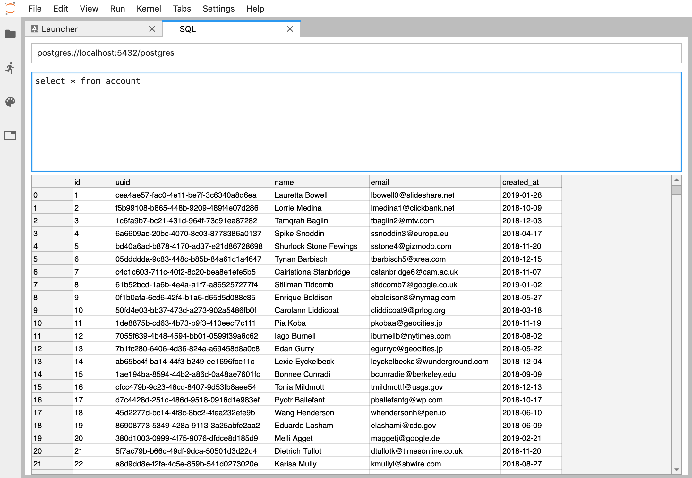

# jupyterlab-sql

JupyterLab extension for interacting with SQL databases.



## Installation

```
pip install jupyterlab_sql
jupyter serverextension enable jupyterlab_sql --py --sys-prefix
jupyter lab build
```

You will then need to restart any running Jupyter servers.

## Usage

### Starting a new SQL session

There is a SQL icon in the launcher (*File* > *New Launcher*):


You can also launch a session from the command palette: search for *SQL*.

### Formulating the connection URL

The connection URL needs to be a valid database URL. Follow the
[SQLAlchemy guide](https://docs.sqlalchemy.org/en/latest/core/engines.html#database-urls)
on database URLs.

### Executing statements

Press `shift` + `enter` while in the main query area to dispatch the
statement.

## Issue reporting and contributing

Report issues using the [issue
tracker](https://github.com/pbugnion/jupyterlab-sql/issues).

Contributions are welcome. If you have not developed JupyterLab
extensions before, I recommend following [this
tutorial](https://jupyterlab.readthedocs.io/en/stable/developer/xkcd_extension_tutorial.html).
